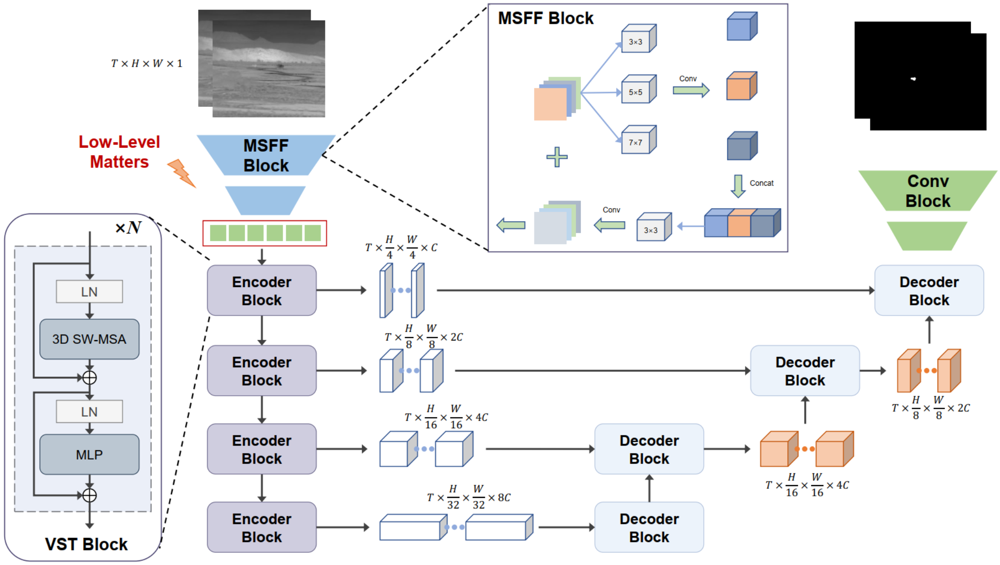
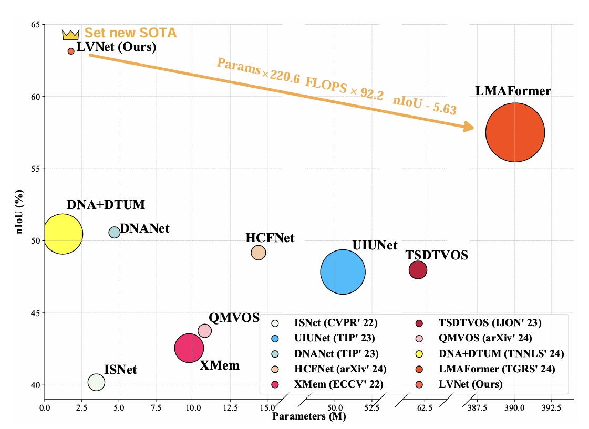

## Low-Level Matters: An Efficient Hybrid Architecture for Robust Multi-frame Infrared Small Target Detection 
[Project](https://github.com/ZhihuaShen/LVNet) - [Paper](https://arxiv.org/pdf/2503.02220)
<hr>

# Abstract
<p align="justify">
Multi-frame infrared small target detection (IRSTD) plays a crucial role in low-altitude and maritime surveillance. The hybrid architecture combining CNNs and Transformers shows great promise for enhancing multi-frame IRSTD performance. In the paper, we propose LVNet, a simple yet powerful hybrid architecture that emphasizes low-level feature learning in hybrid frameworks for multi-frame IRSTD. Our key insight is that the standard linear patch embeddings in Vision Transformers are insufficient for capturing the scale-sensitive local features critical to infrared small targets. To overcome this limitation, we design a multi-scale CNN frontend that explicitly models local features by leveraging the local spatial bias of convolution. Additionally, we introduce a U-shaped video Transformer for multi-frame spatiotemporal context modeling, effectively capturing the motion characteristics of targets. To the best of our knowledge, we are the first to introduce the concept of ``low-level matters" within the CNN-Transformer hybrid architecture for multi-frame IRSTD. Despite its simplicity, with only 1.77M parameters and 17.88G FLOPs, LVNet achieves state-of-the-art (SOTA) performance at a speed of 208 FPS. Experiments on multiple public datasets, comparing LVNet with 18 SOTA methods, demonstrate its superior performance and efficiency. Our code and pre-trained models are accessible at https://github.com/ZhihuaShen/LVNet.
</p>


# Architecture
<p align="center">
  
</p>
Overall Architecture of LVNet.

# Installation


## Environment Setup
The experiments were done on Windows11 with python 3 using anaconda environment. Here is details on how to set up the conda environment.
(If you do not have anaconda 3 installed, first do it following the set up instruction from [here](https://www.anaconda.com/products/distribution)) 

* Create conda environment:
 
  ```create environment
  conda create -n LVNet python=3
  conda activate LVNet
  ```

## Datasets
We evaluate network performance using NUDR-MIRSDT and IRDST

Here is the list of datasets used. 

- [NUDT-MIRSDT](https://pan.baidu.com/s/1pSN350eurMafLiHBQBnrPA?pwd=5whn) (Extraction code: 5whn)
- [IRDST](https://drive.google.com/file/d/1sb-32pydlpXvlNxwx9niT2t6KP9oMJID/view?usp=sharing)

# Training 

  ```
  python train.py
  ```

# Inference
### Inference on NUDT-MIRSDT:
    ```
        python inference.py 
    ```

## Results Summary
<p align="center">
  
</p>
### Results on NUDT-MIRSDT and IRDST
| Dataset  | Checkpoint                                                                                        | IoU  | nIoU | Pd | Fa |
|-----------|---------------------------------------------------------------------------------------------------|------|------|------|------|
| NUDT-MIRSDT | [checkpoint](https://github.com/ZhihuaShen/LVNet)  | 91.66  | 91.99  | 98.82  | 6.28 |
| IRDST | [checkpoint](https://github.com/ZhihuaShen/LVNet)  | 65.93  | 63.14  | 98.32 |  19.22 |


### Acknowledgement
We would like to thank the open-source projects with  special thanks to [LMAFormer](https://github.com/lifier/LMAFormer)  and [Video Swin Transformer](https://github.com/haofanwang/video-swin-transformer-pytorch) for making their code public. Part of the code in our project are collected and modified from several open source repositories.

## Citation
Please consider citing our paper in your publications if the project helps your research. BibTeX reference is as follow.

```
@article{shen2025low,
  title={Low-Level Matters: An Efficient Hybrid Architecture for Robust Multi-frame Infrared Small Target Detection},
  author={Shen, Zhihua and Chen, Siyang and Wang, Han and Zhang, Tongsu and Zhang, Xiaohu and Xu, Xiangpeng and Yang, Xia},
  journal={arXiv preprint arXiv:2503.02220},
  year={2025}
}
```
