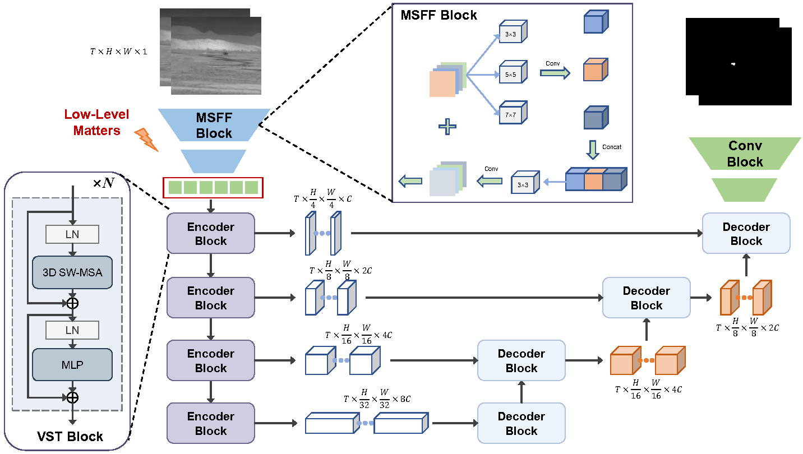

# LVNet
<h1 align="center"> Low-Level Matters: An Efficient Hybrid Architecture for Robust Multi-frame Infrared Small Target Detection </h1> 

  

  

## Datasets
We evaluate network performance using NUDR-MIRSDT and IRDST

Here is the list of datasets used. 

- [NUDT-MIRSDT](https://pan.baidu.com/s/1pSN350eurMafLiHBQBnrPA?pwd=5whn) (Extraction code: 5whn)
- [IRDST](https://drive.google.com/file/d/1sb-32pydlpXvlNxwx9niT2t6KP9oMJID/view?usp=sharing)

